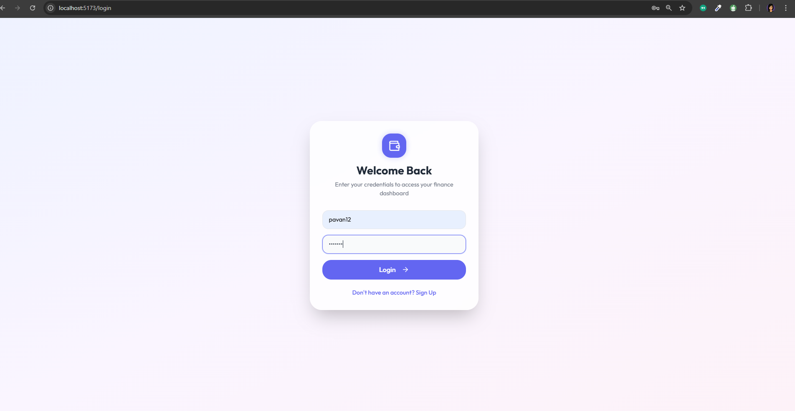
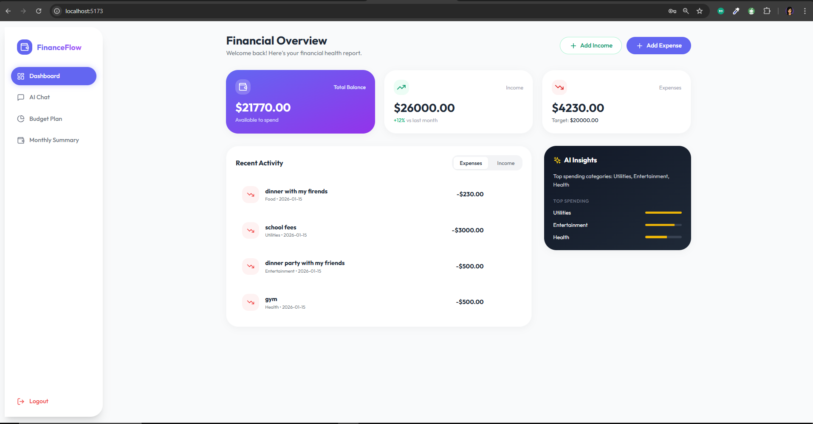
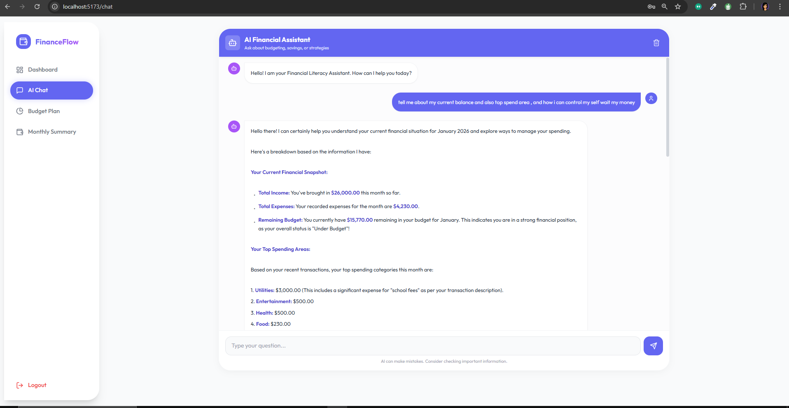
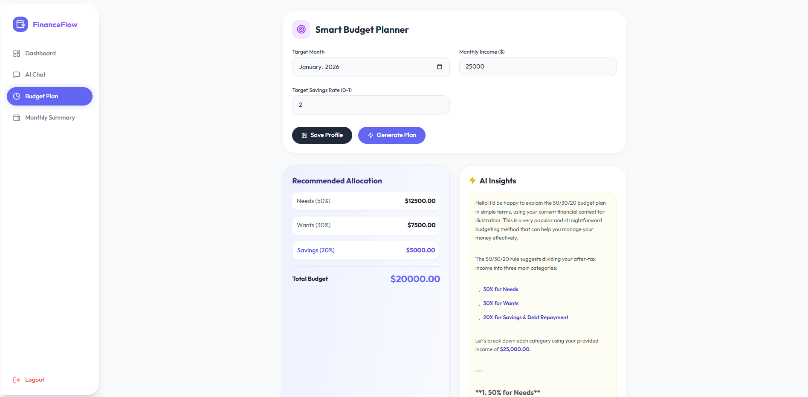
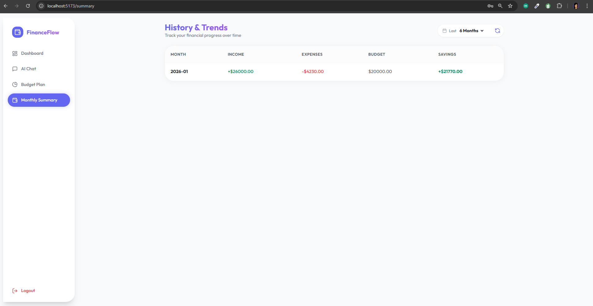

# FinanceFlow - Personal Finance Management System

## 📋 Project Overview

**FinanceFlow** is a modern, full-stack personal finance management application that helps users track their income, expenses, and budgets while providing AI-powered financial literacy education. Built with a focus on user experience and financial wellness, the application combines intuitive design with powerful features to make personal finance management accessible and educational.

### Purpose

The primary goal of FinanceFlow is to:
- **Empower users** to take control of their personal finances
- **Educate** users about financial literacy through AI-powered conversations
- **Simplify** budget tracking and expense management
- **Provide insights** into spending patterns and financial health
- **Encourage** healthy financial habits through data-driven recommendations

---

## 🚀 Key Features

### 1. **User Authentication & Security**
- Secure user registration and login system
- JWT (JSON Web Token) based authentication
- Argon2 password hashing for maximum security
- Session management with token expiration

### 2. **Financial Dashboard**
- Real-time financial overview with key metrics
- Visual representation of income vs. expenses
- Budget status tracking (On Track, Over Budget, Under Budget)
- Category-wise spending breakdown
- Recent transaction history
- Quick-add functionality for income and expenses

### 3. **AI Financial Assistant**
- Powered by Google's Gemini 2.5 Flash AI model
- Context-aware conversations based on user's financial data
- Educational focus on financial literacy (not financial advice)
- Topics covered: budgeting methods (50/30/20 rule), saving strategies, financial terms
- Chat history persistence for continuity
- Beautiful markdown formatting for AI responses (bold text, lists, headings)

### 4. **Smart Budget Planner**
- AI-generated budget recommendations based on the 50/30/20 rule
- Customizable monthly income and savings rate
- Visual breakdown of recommended allocations:
  - **50%** for Needs
  - **30%** for Wants
  - **20%** for Savings
- AI-powered insights and personalized recommendations

### 5. **Monthly Summary**
- Comprehensive monthly financial reports
- Income and expense tracking by month
- Budget performance analysis
- Emergency fund recommendations (3 months of expenses)
- Alerts for overspending and budget violations
- Top spending categories identification

### 6. **Expense & Income Management**
- Easy-to-use forms for adding transactions
- Category-based expense tracking
- Date-based filtering and organization
- Source tracking for income
- Real-time updates to dashboard metrics

---

## 🛠️ Technology Stack

### **Backend**
- **Framework**: FastAPI (Python)
- **Database**: Supabase (PostgreSQL)
- **Authentication**: JWT with python-jose
- **Password Hashing**: Argon2 (via passlib)
- **AI Integration**: LangChain + Google Gemini AI
- **Data Validation**: Pydantic
- **API Documentation**: Auto-generated Swagger/OpenAPI docs

### **Frontend**
- **Framework**: React 18
- **Build Tool**: Vite
- **Routing**: React Router DOM v6
- **Styling**: Tailwind CSS
- **Icons**: Lucide React
- **Animations**: Framer Motion
- **HTTP Client**: Axios
- **State Management**: React Hooks (useState, useEffect)

### **Development Tools**
- **Version Control**: Git
- **Package Managers**: npm (frontend), pip (backend)
- **Environment Management**: python-venv (backend)

---

## 📦 Installation & Setup

### Prerequisites
- **Node.js** (v16 or higher)
- **Python** (v3.10 or higher)
- **Supabase Account** (for database)
- **Google AI API Key** (for Gemini AI)

### Backend Setup

1. **Navigate to backend directory**:
   ```bash
   cd finance/backend
   ```

2. **Create and activate virtual environment**:
   ```bash
   python -m venv venv
   
   # On Windows:
   venv\\Scripts\\activate
   
   # On macOS/Linux:
   source venv/bin/activate
   ```

3. **Install dependencies**:
   ```bash
   pip install -r requirements.txt
   ```

4. **Configure environment variables**:
   Create a `.env` file in the `backend` directory with:
   ```env
   SUPABASE_URL=your_supabase_project_url
   SUPABASE_KEY=your_supabase_anon_key
   GOOGLE_API_KEY=your_google_gemini_api_key
   SECRET_KEY=your_secure_secret_key_for_jwt
   ```

5. **Set up database schema**:
   - Log into your Supabase project
   - Go to SQL Editor
   - Run the SQL script from `database_schema.sql`

6. **Run the backend server**:
   ```bash
   uvicorn app.main:app --reload
   ```
   The API will be available at `http://localhost:8000`

### Frontend Setup

1. **Navigate to frontend directory**:
   ```bash
   cd finance/frontend
   ```

2. **Install dependencies**:
   ```bash
   npm install
   ```

3. **Run the development server**:
   ```bash
   npm run dev
   ```
   The application will be available at `http://localhost:5173`

---

## 📖 How to Use the Application

### First-Time Setup

1. **Register an Account**:
   - Navigate to the login page
   - Click "Sign Up"
   - Enter a unique username and secure password
   - Click "Sign Up" to create your account

2. **Login**:
   - Enter your credentials
   - Click "Login"
   - You'll be redirected to the dashboard

### Using the Dashboard

1. **View Financial Overview**:
   - See your total balance, income, and expenses at a glance
   - Check your budget status
   - Review recent transactions

2. **Add Income**:
   - Click "+ Add Income" button
   - Enter amount, source, and date
   - Click "Add Income"

3. **Add Expense**:
   - Click "+ Add Expense" button
   - Enter amount, category, description, and date
   - Click "Add Expense"

### Using the AI Chat

1. **Navigate to AI Chat**:
   - Click "AI Chat" in the sidebar

2. **Ask Questions**:
   - Type your financial literacy question
   - The AI will provide educational insights based on your financial context
   - Examples:
     - "What is the 50/30/20 budgeting rule?"
     - "How can I save more money?"
     - "What does APR mean?"

3. **View Chat History**:
   - All conversations are saved automatically
   - Clear history using the trash icon if needed

### Using the Budget Planner

1. **Navigate to Budget Planner**:
   - Click "Budget Plan" in the sidebar

2. **Set Your Parameters**:
   - Select target month
   - Enter monthly income
   - Set savings rate (0-1, e.g., 0.2 for 20%)

3. **Generate Plan**:
   - Click "Generate Plan"
   - View AI-generated budget allocation
   - Read personalized AI insights

### Viewing Monthly Summary

1. **Navigate to Monthly Summary**:
   - Click "Monthly Summary" in the sidebar

2. **Review Your Finances**:
   - See total income and expenses for the current month
   - Check budget status and alerts
   - Review category breakdown
   - View emergency fund recommendations

---

## 🎨 Features Breakdown

### Dashboard Page
**Location**: `/`

**Features**:
- **Financial Overview Card**: Displays total balance with gradient background
- **Income Card**: Shows total income with percentage change
- **Expenses Card**: Shows total expenses with budget target
- **Quick Actions**: Add income/expense buttons
- **Recent Activity**: List of recent transactions with icons
- **Category Breakdown**: Visual representation of spending by category

### AI Chat Page
**Location**: `/chat`

**Features**:
- **Chat Interface**: Modern chat bubble design
- **AI Avatar**: Bot icon for AI messages
- **User Avatar**: User icon for user messages
- **Markdown Rendering**: Custom formatter for bold text, lists, and headings
- **Chat History**: Persistent conversation history
- **Clear History**: Option to delete all chat messages
- **Context-Aware**: AI has access to your current financial status

### Budget Planner Page
**Location**: `/planner`

**Features**:
- **Input Form**: Month, income, and savings rate inputs
- **Save Profile**: Store your financial profile
- **Generate Plan**: AI-powered budget generation
- **Allocation Display**: Visual breakdown of 50/30/20 rule
- **AI Insights**: Personalized recommendations with markdown formatting

### Monthly Summary Page
**Location**: `/summary`

**Features**:
- **Monthly Metrics**: Income, expenses, and budget status
- **Alerts**: Warnings for overspending
- **Category Breakdown**: Detailed spending analysis
- **Emergency Fund**: 3-month expense recommendation
- **Insights**: Top spending categories

---

## 💡 Implementation Approach

### Architecture

The application follows a **client-server architecture** with clear separation of concerns:

1. **Frontend (React)**:
   - Component-based architecture
   - Reusable UI components
   - Custom hooks for data fetching
   - Protected routes for authentication
   - Responsive design for mobile and desktop

2. **Backend (FastAPI)**:
   - RESTful API design
   - Modular structure with routers, services, and schemas
   - Dependency injection for database and authentication
   - Error handling and validation
   - CORS configuration for frontend communication

3. **Database (Supabase/PostgreSQL)**:
   - Relational data model
   - Tables: users, sessions, profiles, income, expenses, budgets, chat_history
   - Foreign key relationships
   - Indexed queries for performance

### Security Implementation

1. **Password Security**:
   - Argon2 hashing algorithm (industry standard)
   - No plain text password storage
   - Salt handled automatically by Argon2

2. **Authentication**:
   - JWT tokens with expiration
   - HS256 algorithm for token signing
   - Token verification on protected routes
   - Automatic logout on token expiration

3. **API Security**:
   - CORS configuration to prevent unauthorized access
   - Input validation using Pydantic schemas
   - SQL injection prevention through ORM
   - Environment variable protection for secrets

### AI Integration

1. **LangChain Framework**:
   - Structured prompt templates
   - Chain-based processing (prompt → LLM)
   - Error handling for API failures

2. **Context Management**:
   - User financial data passed as context
   - Personalized responses based on budget status
   - Educational focus with clear boundaries

3. **Response Formatting**:
   - Custom markdown parser for frontend
   - Support for bold text, lists, and headings
   - Clean, readable output

### Custom Markdown Renderer

To avoid dependency issues with `react-markdown`, a custom `MessageContent` component was implemented:

```javascript
// Parses markdown syntax:
// - **bold text** → <strong>
// - * list items → bullet points
// - ### headings → <h3>
```

This provides:
- Zero external dependencies
- Full control over styling
- Consistent rendering across browsers
- Better performance

---

## ✅ Pros & Strengths

### Technical Strengths

1. **Modern Tech Stack**:
   - Latest versions of React and FastAPI
   - Fast build times with Vite
   - Type safety with Pydantic

2. **Scalable Architecture**:
   - Modular code organization
   - Easy to add new features
   - Clear separation of concerns

3. **Security First**:
   - Industry-standard password hashing
   - JWT authentication
   - Environment variable protection

4. **AI-Powered**:
   - Google's latest Gemini model
   - Context-aware responses
   - Educational focus

### User Experience Strengths

1. **Beautiful Design**:
   - Modern, clean interface
   - Smooth animations with Framer Motion
   - Responsive on all devices
   - Consistent color scheme and typography

2. **Intuitive Navigation**:
   - Clear sidebar navigation
   - Mobile-friendly bottom navigation
   - Logical page flow

3. **Real-Time Updates**:
   - Instant feedback on actions
   - Live dashboard updates
   - No page reloads needed

4. **Educational Value**:
   - AI assistant teaches financial concepts
   - Budget recommendations based on proven methods
   - Insights into spending patterns

### Development Strengths

1. **Well-Documented Code**:
   - Comprehensive comments
   - Clear function documentation
   - Type hints in Python

2. **Easy Setup**:
   - Clear installation instructions
   - Environment variable templates
   - Database schema provided

3. **Maintainable**:
   - Consistent code style
   - Modular structure
   - Reusable components

---

## 🔧 Development Process

### Phase 1: Planning & Design
1. Identified core features and user needs
2. Designed database schema
3. Created wireframes for UI
4. Selected technology stack

### Phase 2: Backend Development
1. Set up FastAPI project structure
2. Implemented authentication system
3. Created database models and schemas
4. Built API endpoints for CRUD operations
5. Integrated Google Gemini AI
6. Added error handling and validation

### Phase 3: Frontend Development
1. Set up React project with Vite
2. Configured Tailwind CSS
3. Built reusable components (Layout, ProtectedRoute)
4. Implemented pages (Dashboard, Chat, Planner, Summary)
5. Added routing and navigation
6. Integrated with backend API

### Phase 4: AI Integration
1. Configured LangChain with Gemini
2. Designed system prompts for financial education
3. Implemented context passing from user data
4. Built chat interface with history
5. Created custom markdown renderer

### Phase 5: Testing & Refinement
1. Fixed authentication issues
2. Resolved database connection errors
3. Debugged chat rendering problems
4. Improved error handling
5. Enhanced UI/UX based on testing

### Phase 6: Documentation
1. Added comprehensive code comments
2. Created detailed README
3. Documented API endpoints
4. Prepared setup instructions

---

## 📸 Screenshots

### Login Page



**Features visible**:
- Clean, modern login interface
- Sign up option for new users
- Secure authentication form
- FinanceFlow branding

---

### Dashboard



**Features visible**:
- Total balance display with gradient background
- Income and expense metrics with percentage changes
- Quick action buttons (Add Income, Add Expense)
- Recent transaction list with category icons
- Budget status indicator

---

### AI Chat Interface



**Features visible**:
- Modern chat bubble design
- AI and user avatars (bot and user icons)
- Markdown-formatted responses with bold text and lists
- Input field and send button
- Clear history option
- Context-aware AI responses based on financial data

---

### Budget Planner



**Features visible**:
- Input form for month, income, and savings rate
- 50/30/20 allocation breakdown (Needs, Wants, Savings)
- AI insights section with personalized recommendations
- Save profile and generate plan buttons
- Visual representation of budget allocation

---

### Monthly Summary



**Features visible**:
- Monthly income and expense totals
- Budget status indicator
- Alerts for overspending
- Category breakdown chart
- Emergency fund recommendation
- Top spending categories

---

## 🔄 Future Enhancements

Potential features for future versions:

1. **Data Visualization**:
   - Charts and graphs for spending trends
   - Visual budget progress bars
   - Yearly comparisons

2. **Advanced AI Features**:
   - Budget optimization suggestions
   - Anomaly detection in spending
   - Predictive analytics

3. **Social Features**:
   - Share budget goals with family
   - Community challenges
   - Financial goal tracking

4. **Integrations**:
   - Bank account linking
   - Receipt scanning
   - Export to Excel/PDF

5. **Mobile App**:
   - Native iOS and Android apps
   - Push notifications for budget alerts
   - Offline mode

---

## 📝 API Documentation

The backend provides auto-generated API documentation:
- **Swagger UI**: `http://localhost:8000/docs`
- **ReDoc**: `http://localhost:8000/redoc`

### Key Endpoints

**Authentication**:
- `POST /auth/signup` - Register new user
- `POST /auth/login` - Login and get JWT token
- `GET /auth/profile` - Get user profile
- `PUT /auth/profile` - Update user profile

**Finance**:
- `GET /finance/summary` - Get monthly summary
- `POST /finance/budget_plan` - Generate AI budget plan
- `POST /finance/income` - Add income
- `POST /finance/expense` - Add expense

**Chat**:
- `POST /chat/generate` - Send message to AI
- `GET /chat/history` - Get chat history
- `DELETE /chat/history` - Clear chat history

---

## 🤝 Contributing

This project was built as a personal finance management system. Contributions, suggestions, and feedback are welcome!

---

## 📄 License

This project is for educational and personal use.

---

## 👨‍💻 Author

Built with ❤️ using modern web technologies and AI.

---

## 🙏 Acknowledgments

- **Google Gemini AI** for powering the financial literacy assistant
- **Supabase** for providing an excellent database platform
- **FastAPI** for the amazing Python web framework
- **React** and **Tailwind CSS** for frontend development
- **LangChain** for AI integration framework

---

**FinanceFlow** - Take control of your finances, one smart decision at a time. 💰✨
